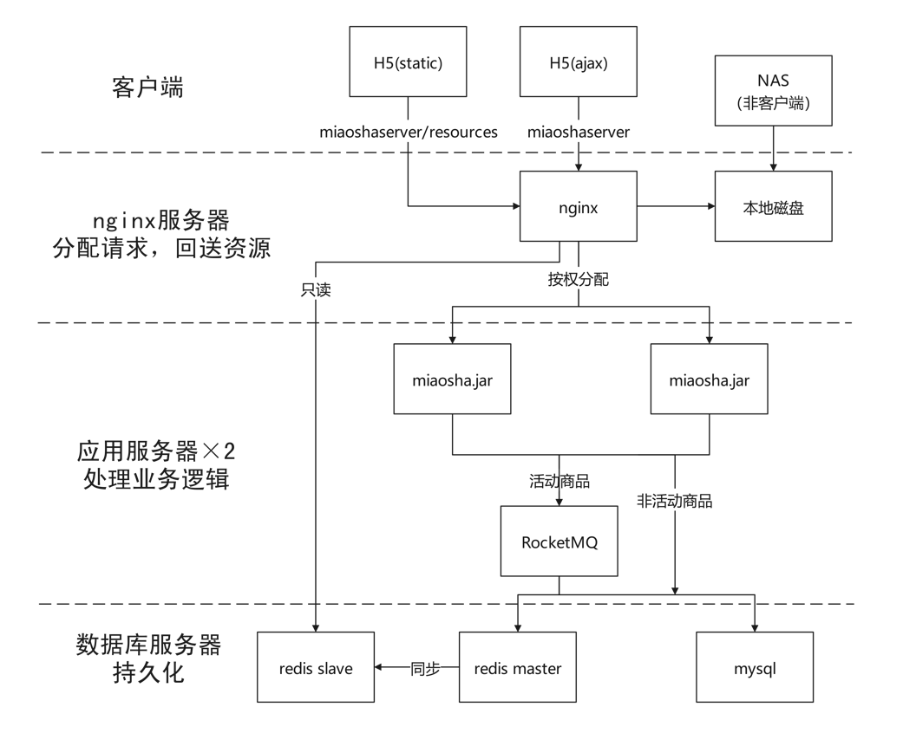

<!DOCTYPE html>
<html lang="en">
<head>
    <meta charset="UTF-8">
</head>
<body>
<h1 style="text-align:center">项目简介</h1>
<h2>基本情况</h2>
<ul>
    <li>伪分布式秒杀项目（经费有点顶不住😅...之前是4台分布式集群，当前这个是单机版）</li>
    <li>项目主要追求性能和并发量，经apache-jmeter压测，tps查询峰值在3Mbps带宽下可达1500，稳定在800，4台服务器分布式部署如果使用本地缓存且不计带宽限制，tps查询峰值可达3000，稳定在1500
    </li>
    <li>开发周期2022.02.01 ~ 2022.03.15，前端代码部分借鉴MOOC、GitHub开源项目，后端代码每行均为个人独立编写</li>
    <li><a href="https://github.com/Y-hai/miaosha" target="_blank">GitHub项目传送门</a></li>
</ul>
<h2>环境及框架</h2>
<ul>
    <li>Windows本地IDEA开发调试，CentOS7.4云部署压测</li>
    <li>Nginx（OpenResty1.13.6.2）</li>
    <li>JDK1.8.0_65（虚拟机：HotSpot）</li>
    <li>SpringBoot2.1.4</li>
    <li>RocketMQ4.4.0</li>
    <li>MySQL5.5.68（线程池：druid1.1.3）</li>
    <li>Redis6.2.6</li>
</ul>
<h2>项目架构图</h2>

</body>
</html>
